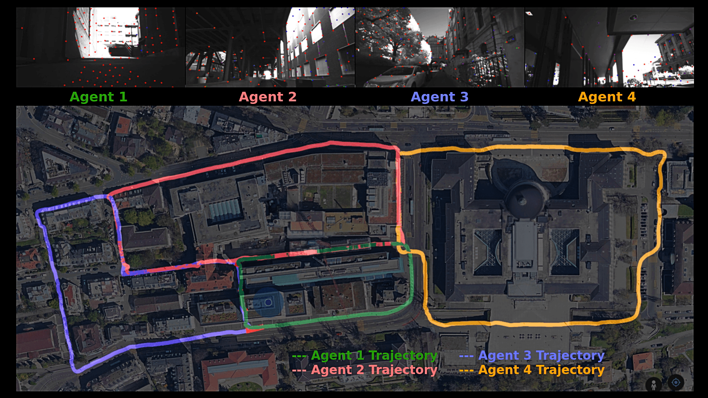

# COVINS-(G) -- A (Generic) Framework for Collaborative Visual-Inertial SLAM and Multi-Agent 3D Mapping

**Version 2.0** (Support for COVINS-G: A Generic Back-end for Collaborative Visual-Inertial SLAM)

COVINS is an accurate, scalable, and versatile visual-inertial collaborative SLAM system, that enables a group of agents to simultaneously co-localize and jointly map an environment. COVINS provides a server back-end for collaborative SLAM, running on a local machine or a remote cloud instance, generating collaborative estimates from map data contributed by different agents running Visual-Inertial Odomety (VIO) and sharing their map with the back-end. 

With the COVINS-G release, we make the server back-end flexible enabling compatibility with any arbitrary VIO/Stereo front-end, including, for example, off-the-shelf cameras with odometry capabilities, such as the Realsense T265. 

 We provide guidance and examples how to run COVINS and COVINS-G on the [EuRoC dataset](https://projects.asl.ethz.ch/datasets/doku.php?id=kmavvisualinertialdatasets), as well as information beyond basic deployment, for example how the COVINS back-end can be deployed on a remote cloud computing instance. Instructions on running COVINS-G with different cameras such as Intel Realsense D455 and T265 Tracking camera, as well as different frontends like VINS-Fusion, ORB-SLAM3 and SVO-pro are also provided.

## Index
  - [1 Related Publications](#1-related-publications)
  - [2 License](#2-license)
  - [3 Basic Setup](#3-basic-setup)
    - [Environment Setup](#environment-setup)
    - [COVINS Installation](#covins-installation)
    - [Installing ROS Support for the ORB-SLAM3 Front-End](#setup_ros)
    - [Installing VINS-Fusion Front-End](#installing-vins-fusion-front-end)
  - [4 Running COVINS](#4-running-covins)
    - [COVINS Back-End](#run_covins)  
      - [Running the COVINS Server Back-End](/docs/run_COVINS.md#run_be)
      - [Running the ORB-SLAM3 Front-End](docs/run_COVINS.md#run_fe)
      - [Visualization](docs/run_COVINS.md#run_viz)
      - [User Interaction](docs/run_COVINS.md#run_intercation)
      - [Parameters](docs/run_COVINS.md#run_params)
      - [Output Files](docs/run_COVINS.md#run_out)
      - [Running COVINS with ROS](docs/run_COVINS.md#run_ros)
    - [COVINS-G Back-End](#run_covinsg)
      - [Running the COVINS-G Server Back-End](docs/run_COVINS-G.md#run_be)
      - [ORB-SLAM3 Front-End](docs/run_COVINS-G.md#run_fe_orb)
      - [VINS-Fusion Front-End](docs/run_COVINS-G.md#run_fe_vins)
      - [ROS-based Front-End Wrapper](docs/run_COVINS-G.md#run_fe_ros)
      - [Mixture of Front-Ends](docs/run_COVINS-G.md#run_fe_mix)
      - [Realsense T265 Tracking Camera](docs/run_COVINS-G.md#run_t265)
      - [Custom Dataset (Realsense D455)](docs/run_COVINS-G.md#run_d455)
      - [Using SIFT Features](docs/run_COVINS-G.md#run_sift)
      - [Visualization](docs/run_COVINS-G.md#run_viz)
      - [User Interaction](docs/run_COVINS-G.md#run_intercation)
      - [Parameters](docs/run_COVINS-G.md#run_params)
      - [Output Files](docs/run_COVINS-G.md#run_out)
  - [5 Docker Implementation](#5-docker-implementation)
    - [Building the Docker Image](#building-the-docker-image)
    - [Running the Docker Image](#running-the-docker-image)
  - [6 Extended Functionalities](#6-extended-functionalities)
    - [Deployment of the COVINS Back-End in an AWS Cloud Instance](#deployment-of-the-covins-back-end-in-an-aws-cloud-instance)
    - [Interfacing a Custom VIO System with COVINS](#interfacing-a-custom-vio-system-with-covins)
    - [Map Re-Use Onboard the Agent (Only for COVINS)](#map-re-use-onboard-the-agent-only-for-covins)
  - [7 Limitations and Known Issues](#7-limitations-and-known-issues)

<a name="related_publications"></a>
## 1 Related Publications

[***COVINS-G***] Manthan Patel, Marco Karrer, Philipp Bänninger and Margarita Chli. **COVINS-G: A Generic Back-end for Collaborative Visual-Inertial SLAM**. *IEEE International Conference on Robotics and Automation (ICRA)*, 2023. **[PDF](https://arxiv.org/abs/2301.07147)**

[***COVINS***] Patrik Schmuck, Thomas Ziegler, Marco Karrer, Jonathan Perraudin and Margarita Chli. **COVINS: Visual-Inertial SLAM for Centralized Collaboration**. *IEEE International Symposium on Mixed and Augmented Reality (ISMAR)*, 2021. **[PDF](https://www.research-collection.ethz.ch/handle/20.500.11850/507909)**

[*Redundancy Detection*] Patrik Schmuck and Margarita Chli. **On the Redundancy Detection in Keyframe-based SLAM**. *IEEE International Conference on 3D Vision (3DV)*, 2019. **[PDF](https://www.research-collection.ethz.ch/bitstream/handle/20.500.11850/380451/2019_redundancy_detection.pdf?sequence=1&isAllowed=y)**.

[*System Architecture*] Patrik Schmuck and Margarita Chli. **CCM‐SLAM: Robust and Efficient Centralized Collaborative Monocular Simultaneous Localization and Mapping for Robotic Teams**. *Journal of Field Robotics (JFR)*, 2019. **[PDF](https://www.research-collection.ethz.ch/handle/20.500.11850/313259)**

[*Collaborative VI-SLAM*] Patrik Schmuck, Marco Karrer and Margarita Chli. **CVI-SLAM - Collaborative Visual-Inertial SLAM**. *IEEE Robotics and Automation Letters (RA-L)*, 2018. **[PDF](https://www.research-collection.ethz.ch/bitstream/handle/20.500.11850/294281/2018_IROS_Karrer.pdf?sequence=7&isAllowed=y)**


#### Video:
COVINS-G: | COVINS:
--- | ---
<a href="https://www.youtube.com/embed/FoJfXCfaYDw" target="_blank"></a> | <a href="https://www.youtube.com/embed/FxJTY5x1fGE" target="_blank"></a>

<a name="license"></a>
## 2 License

COVINS is released under a [GPLv3 license](https://github.com/VIS4ROB-lab/covins/blob/master/.aux/licencse_gpl.txt). For a list of code/library dependencies (and associated licenses), please see [thirdparty_code.md](https://github.com/VIS4ROB-lab/covins/blob/master/.aux/thirdparty_code.md).


For license-related questions, please contact the authors:
collaborative (dot) slam (at) gmail (dot) com.

If you use COVINS in an academic work, please cite:

	@article{schmuck2021covins,
	  title={COVINS: Visual-Inertial SLAM for Centralized Collaboration},
	  author={Schmuck, Patrik and Ziegler, Thomas and Karrer, Marco and Perraudin, Jonathan and Chli, Margarita},
	  journal={arXiv preprint arXiv:2108.05756},
	  year={2021}
	}

If you use the COVINS-G extension in an academic work, please cite both the original COVINS publication and additionally:

    @article{patel23covinsg,
      title = {COVINS-G: A Generic Back-end for Collaborative Visual-Inertial SLAM},
      doi = {10.48550/ARXIV.2301.07147},
      url = {https://arxiv.org/abs/2301.07147},
      author = {Patel, Manthan and Karrer, Marco and Bänninger, Philipp and Chli, Margarita},
      publisher = {arXiv},
      year = {2023},
    }


<a name="setup"></a>
## 3 Basic Setup
This section explains how you can build the COVINS server back-end, as well as the provided version of the ORB-SLAM3 front-end able to communicate with the back-end. Morover, the COVINS-G extension provides a generic ROS front-end wrapper to support any arbitrary VIO/tracking cameras as well as support for VINS-Fusion. We provide installation instructions for Ubuntu *18.04* as well as *20.04*. Note that we also provide a [Docker implementation](#docker) for simplified deployment of COVINS.

**Note**: Please pay attention to the ```CMAKE_BUILD_TYPE```. Particularly, building parts of the code with ```march=native``` can cause problems on some machines.

<a name="setup_env"></a>
### Environment Setup

#### Dependencies

* ```sudo apt-get update```
* Install dependencies: ```sudo apt-get install libpthread-stubs0-dev build-essential cmake git doxygen libsuitesparse-dev libyaml-cpp-dev libvtk6-dev python3-wstool libomp-dev libglew-dev```
* _catkin_tools_ (from the [catkin_tools manual](https://catkin-tools.readthedocs.io/en/latest/installing.html))
    * ```sudo sh -c 'echo "deb http://packages.ros.org/ros/ubuntu `lsb_release -sc` main" > /etc/apt/sources.list.d/ros-latest.list'```
    * ```wget http://packages.ros.org/ros.key -O - | sudo apt-key add -```
    * ```sudo apt-get update```
    * ```sudo apt-get install python3-catkin-tools```
* _ROS_
    * [Melodic](https://wiki.ros.org/melodic/Installation/Ubuntu) (Ubuntu 18)
    * [Noetic](https://wiki.ros.org/noetic/Installation/Ubuntu) (Ubuntu 20)

#### Set up your workspace

This will create a workspace for COVINS as ```~/ws/covins_ws```. All further commands will use this  path structure - if you decide to change the workspace path, you will need to adjust the commands accordingly.

* ```cd ~```
* ```mkdir -p ws/covins_ws/src```
* ```cd ~/ws/covins_ws```
* ```catkin init```
* ROS Setup
    * **U18/Melodic**: ```catkin config --extend /opt/ros/melodic/```
    * **U20/Noetic**: ```catkin config --extend /opt/ros/noetic/```
* ```catkin config --merge-devel```
* ```catkin config --cmake-args -DCMAKE_BUILD_TYPE=RelWithDebInfo```

<a name="setup_covins"></a>
### COVINS Installation

#### Note on Virtual Machines

If you are installing COVINS in a **Virtual Machine** (VM) or a computer with fewer resources, make sure to allocate enough memory and/or swap to ensure a successful installation. We have successfully tested the COVINS installation with a VM with 16 GB RAM and 10 GB swap. Instructions how to change the swap size can be found [here](https://ploi.io/documentation/server/change-swap-size-in-ubuntu).

#### Installation Manual

We provide a script (```covins/install_file.sh```) that will perform a full installation of COVINS, including back-end, front-end, and third-party packages, if the environment is set up correctly. **If the installation fails, we strongly recommend executing the steps in the build script manually one by one**. The script might not perform a correct installation under certain circumstances if executed multiple times.

* ```cd ~/ws/covins_ws/src```
* ```git clone https://github.com/VIS4ROB-lab/covins.git```
* ```cd ~/ws/covins_ws```
* ```chmod +x src/covins/install_file.sh```
* ```./src/covins/install_file.sh 8```
    * The argument ```8``` is optional, and specifies the number of jobs the build process should use.
    * The COVINS back-end needs to be built only on the Server. For the agents, building just the front-end is sufficient. The ROS front-end wrapper (only compatible with COVINS-G) would be useful in cases where you would like to use a Realsense T265 tracking camera or any arbitrary VIO/stereo frontend without any modifications.
        * To build the ROS front-end Wrapper only run the following command:
          * ```./src/covins/install_file.sh -f 8```
        * To build ORB-SLAM3 only (No back-end), run the following command:
          * ```./src/covins/install_file.sh -o 8```

Generally, when the build process of COVINS or ORB-SLAM3 fails, make sure you have correctly sourced the workspace, and that the libraries in the third-party folders, such as ```DBoW2``` and ```g2o``` are built correctly.

A remark on ```fix_eigen_deps.sh```: compiling code with dependencies against multiple ```Eigen``` versions is usually fatal and must be avoided. Therefore, we specify and download the ```Eigen``` version explicitly through the ```eigen_catkin``` package, and make sure all ```Eigen```  dependencies point to this package.

<a name="setup_ros"></a>
### Installing ROS Support for the ORB-SLAM3 Front-End

If you want to use `rosbag` files to pass sensor data to COVINS, you need to explicitly build the ORB-SLAM3 front-end with ROS support.

* Install _vision_opencv_:
    * ```cd ~/ws/covins_ws/src```
    * Clone: ```git clone https://github.com/ros-perception/vision_opencv.git```
    * **Check out the correct branch**
        * ```cd vision_opencv/```
        * *U18/Melodic*: ```git checkout melodic```
        * *U20/Noetic*: ```git checkout noetic```
    * Open ```~/ws/covins_ws/src/vision_opencv/cv_bridge/CMakeLists.txt```
        * Add the ```opencv3_catkin``` dependency: change the line ```find_package(catkin REQUIRED COMPONENTS rosconsole sensor_msgs)``` to ```find_package(catkin REQUIRED COMPONENTS rosconsole sensor_msgs opencv3_catkin)```
        * If you are running **Ubuntu 20** (or generally have OpenCV 4 installed): remove the lines that search for an OpenCV 4 version in the ```CMakeLists.txt```. It should look like this:
        
    * ```source ~/ws/covins_ws/devel/setup.bash```
    * ```catkin build cv_bridge```
    * [Optional] Check correct linkage:
        * ```cd ~/ws/covins_ws/devel/lib```
        * ```ldd libcv_bridge.so | grep opencv_core```
        * This should only list ```libopencv_core.so.3.4``` as a dependency
* ```catkin build ORB_SLAM3```
* [Optional] Check correct linkage:
    * ```cd ~/ws/covins_ws/src/covins/orb_slam3/Examples/ROS/ORB_SLAM3```
        * ```ldd Mono_Inertial | grep opencv_core```
        * This should mention ```libopencv_core.so.3.4``` as the only ```libopencv_core``` dependency

<a name="setup_vins"></a>
### Installing VINS-Fusion Front-End

If you would like to use a VINS-Fusion Front-end (only compatible with COVINS-G), we provide a modified version of the original VINS-Fusion repository which is made compatible with COVINS. The modified repository is available [here (VINS-COVINS-adaptation)](https://github.com/manthan99/VINS-COVINS-adaptation). Follow the Readme for installation instructions. Note, we only provide support for using VINS-Fusion with docker due to compilation issue of VINS-Fusion on Ubuntu 20.04.

<a name="running"></a>
## 4 Running COVINS

We provide easy switching between the different backends (COVINS and COVINS_G) by specifying the ```placerec.type``` parameter in the ```~/ws/covins_ws/src/covins/covins_backend/config/config_backend.yaml``` file. In general, ```COVINS``` would be able to provide more accurate estimates after performing the Global Bundle Adjustment (GBA), but is limited by the flexibility in terms of the choice of front-end (works well with ORB_SLAM3 but not VINS-Fusion). On the other hand, ```COVINS_G``` is compatible with any arbitrary front-end but cannot perform GBA since map-points are not utilized in the back-end. We refer to the COVINS_G paper for more details about the use-cases of the different back-ends.

<a name="run_covins"></a>
### COVINS Back-End

The instructions for running a COVINS back-end can be found [here](/docs/run_COVINS.md).

<a name="run_covinsg"></a>
### COVINS-G Back-End

The instructions for running a COVINS-G back-end can be found [here](/docs/run_COVINS-G.md).

<a name="docker"></a>
## 5 Docker Implementation

We provide COVINS also as a Docker implementation. A guide how to install docker can be found [here](https://docs.docker.com/engine/install/). To avoid the need of `sudo` when running the commands below you can add your user to the `docker` group.

```sudo usermod -aG docker $USER``` (see https://docs.docker.com/engine/install/linux-postinstall/)

### Building the Docker Image

**NOTE:** The provided docker implementation will **not build** if you have previously built your cloned version of COVINS in a catkin workspace using the instructions provided above. If you want to use the docker implementation, please **perform the docker build with a freshly cloned version of COVINS**

Build the docker file using the Make file provided in the `docker` folder. Provide the number of jobs `make` and `catkin build` should use. This can take a while. If the build fails try again with a reduced number of jobs value.

* ```make build NR_JOBS=14```
    
### Running the Docker Image
The docker image can be used to run different parts of COVINS (e.g. server, ORB-SLAM3 front-end, ...).

#### ROSCORE
To start the roscore one can either use the host system ROS implementation (if ROS is installed). Otherwise, it can be started using the docker image.
* ```./run.sh -c```

#### COVINS Server Back-End
The convins server back-end needs a running roscore, how to start one see above. Furthermore, the server needs two configuration files, one for the communication server on one for the back-end. These two files need to be linked when running the docker image.
* ```./run.sh -s ../covins_comm/config/config_comm.yaml ../covins_backend/config/config_backend.yaml```

#### ORB-SLAM3 Front-End
The ORB-SLAM3 front-end client needs the communication server config file, the file which should be executed, and the path to the dataset. The dataset has to be given seperately since the file system of the docker container differs from the host system. Hence, the `pathDatasetEuroc` variable in the run script gets adapted automatically inside the docker container.
* ```./run.sh -o ../covins_comm/config/config_comm.yaml ../orb_slam3/covins_examples/euroc_examples_mh1 <dataset_path, e.g. /home/pschmuck/data/euroc>```

#### ORB-SLAM3 ROS Front-End
The ROS wrapper of the ORB-SLAM3 front-end can also be started in the docker container. It requires the server config file and the ROS launch file. A bag file can then for example be played on the host system.
* ```./run.sh -r ../covins_comm/config/config_comm.yaml ../orb_slam3/Examples/ROS/ORB_SLAM3/launch/launch_docker_ros_euroc.launch```

#### ROS Front-End Wrapper (Only for COVINS-G)
The ROS Front-end wrapper can also be started in the docker container. It requires the server config file and the ROS launch file. A bag file can then for example be played on the host system.
* ```./run.sh -f ../covins_comm/config/config_comm.yaml ../covins_frontend/launch/covins_frontend/launch/vins_docker_euroc_agent.launch```

#### Terminal
A terminal within the docker image can also be opened. This can for example be used to send `rosservice` commands.
* ```./run.sh -t```

<a name="extended"></a>
## 6 Extended Functionalities

<a name="ext_aws"></a>
### Deployment of the COVINS Back-End in an AWS Cloud Instance

We have tested COVINS with remote cloud servers provides by [Amazons AWS](https://aws.amazon.com/). We recommend using [screen](https://linuxize.com/post/how-to-use-linux-screen/) to run COVINS remotely on a cloud instance, since this allows to return to previous sessions evens after disconnecting from the remote instance.
[Tutorial: Get started with Amazon EC2 Linux instances](https://docs.aws.amazon.com/AWSEC2/latest/UserGuide/EC2_GetStarted.html)

#### Cloud Setup

* Choose an AWS instance to launch (EC2 instance, Ubuntu 18 or 20 virtual machine, for example a ```c4.4xlarge``` with 30 GB storage is a good starting point)
* AWS virtual machines by default block most incoming and outgoing traffic, so you need to adjust the security groups. Don't forget to modify both inbound and outbound rules.
    * Some information on setting security groups can be found [here](https://aws.amazon.com/premiumsupport/knowledge-center/connect-http-https-ec2/).
    * As a straightforward solution, you can just allow **any** traffic: In *Step 6: Configure Security Group* of the AWS instance launch process, add a rule as follows (note that this leaves your remote server also unprotected against unauthorized access):

<!--
    * The following rules will allow **any** traffic (note that this leaves your remote server also unprotected against unauthorized access):

-->
* Launch your instance and install COVINS
* On your local machine (or any other machine where you would like to run the front-end), set ```sys.server_ip``` in ```config_comm.yaml``` to the **public** IPv4 address of your instance
    * Try to ping the IP from your local machine. If this does not work, the security groups are definitely not set up correctly and the back-end on the remote instance will not be reachable.
* Start the covins back-end on the remote instance as usual using ```rosrun covins_backend covins_backend_node```
* Start the front-end on your local machine as usual using one of the provided example files.
* The front-end should be able to connect to the cloud server, and you should see the server displaying messages that data is arriving there.

#### Visualization

We will use [screen](https://linuxize.com/post/how-to-use-linux-screen/) to run COVINS remotely on a cloud server

* On the **remote server** (connect via ssh - your AWS instance will give instructions how to do this)
    * ```screen -S covins```
    * ```roscore```
    * New window: ```Ctrl+a```, then ```c```
    * ```export ROS_IP=public_IP_of_!SERVER!```
    * ```cd ~/ws/covins_ws/```
    * ```source devel/setup.bash```
    * ```roslaunch src/covins/covins_backend/launch/tf.launch```
    * New window: ```Ctrl+a```, then ```c```
    * ```export ROS_IP=public_IP_of_!SERVER!```
    * ```cd ~/ws/covins_ws/```
    * ```source devel/setup.bash```
    * Run the back-end using ```rosrun covins_backend covins_backend_node```
* In a shell on your **local machine**
    * ```export ROS_IP=IP_of_your_!LOCAL!_machine```
    * ```export ROS_MASTER_URI=http://IP_of_the_!SERVER!:11311```
    * Launch RVIZ: ```rviz -d ~/ws/covins_ws/src/covins/covins_backend/config/covins.rviz``` (you need to have ```covins.rviz```  locally.
* Now you should be able to remotely visualize the RVIZ topics published from the COVINS backend running on the cloud server.

<a name="ext_comm"></a>
### Interfacing a Custom VIO System with COVINS

COVINS exports a generic communication interface, that can be integrated into custom keyframe-based VIO systems in order to share map data with the server back-end and generate a collaborative estimate. The code for the communication interface is located in the ```covins_comm``` folder, which builds a library with the same name that facilitates communication between the VIO system onboard the agent and the COVINS server back-end.

For straightforward understanding which steps need to be taken to interface a VIO front-end with COVINS, we have defined the preprocessor macro ```COVINS_MOD``` in ```covins/covins_comm/include/covins/covins_base/typedefs_base.hpp```. **This macro indicates all modifications made to the original ORB-SLAM3 code in order to set up the communication with the server back-end.**

In a nutshell, the communication interface provides a base communicator class, which is intended to be used to create a derived communicator class tailored to the VIO system. The communicator module runs in a separate thread, taking care of setting up a connection to the server, and exchanging map data. For the derived class, the user only needs to define a function that can be used to pass data to the communicator module and fill the provided data containers, and the ```Run()``` function that is continuously executed by the thread allocated to the communicator module. Furthermore, the communicator module uses the predefined message types ```MsgKeyframe``` and ```MsgLandmark``` for transmitting data to the server, therefore, the user needs to define functions that fill those messages from the custom data structures of the VIO system.

<a name="ext_reuse"></a>
### Map Re-Use Onboard the Agent (Only for COVINS)

COVINS also provides the functionality to share data from the collaborative estimate on the server-side with the agents participating in the estimate. COVINS provides only the infrastructure to share this data, the method for map re-use needs to be implement by the user.

By default, COVINS is configured to not send any data back to the agent. By setting ```comm.data_to_client``` to ```1``` in ```config_comm.yaml```, this functionality can be activated. By default, the server then regularly sends information about one keyframe back to the agent. The agent will display a message that requests the user to define what to do with the received information.

* In the function ```CollectDataForAgent()``` in ```covins_backend/src/covins_backend/```, the data to send to the agent can be specified.
* In the function ```ProcessKeyframeMessages()``` in ```orb_slam3/src/```, the processing of the received keyframe can be specified.

<a name="issues"></a>
## 7 Limitations and Known Issues

* [**TOGGLING VISUALIZATION**] When running multiple agents in parallel, and the maps are not merged yet, the visualization in RVIZ might toggle between the visualization of both trajectories.
* [**MAP RESET**] ORB-SLAM3 has the functionality to **start a new map** when tracking is lost, in order to improve robustness. This functionality is **not supported** by COVINS. The COVINS server back-end assumes that keyframes arriving from a specific agent are shared in a continuous fashion and belong to the same map, and if the agent map is reset and a second keyframe with a previously used ID arrives again at the server side, the back-end will detect this inconsistency and throw an error. We have almost never experienced this behavior on the EuRoC sequences when using the ASL dataset format, and rarely when using rosbag files. 
    * Too little computational resources available to the front-end can be a reason for more frequent map resets.
    * Map resets are more frequent at the beginning of a dataset, and occur less when the VIO front-end is well initialized and already tracking the agent's pose over some time. Therefore, the communication module will only start sending data to the server once a pre-specified number of keyframes was created by the VIO front-end. This number is specified by ```comm.start_sending_after_kf``` in ```covins/covins_comm/config/config_comm.yaml```, and is currently set to 50.
    * Particularly when running with rosbag files, setting the parameter  ```orb.imu_stamp_max_diff: 2.0``` in ```covins/covins_comm/config/config_comm.yaml```, instead of the default (```1.0```), helped to significantly reduce map resets. We did not see any negative impact on the accuracy of the COVINS collaborative estimate from this change.
* [**Duplicate Files**] The repository contains 2 copies of the ORB vocabularies, as well as 2 versions of the DBoW library. We decided to use this structure in order to keep the code of COVINS and ORB-SLAM3 as much separated as possible.
* [**Mixed Notation**] COVINS mainly utilizes the *Google C++ Style Guide*. However, some modules re-use code of other open-source software using *Hungarian notation*, such as CCM-SLAM and ORB-SLAM2, and this code was not ported to the new notation convention yet (particularly, this applies to code parts related to the FeatureMatcher, KFDatabase, PlaceRecognition, Se3Solver).
