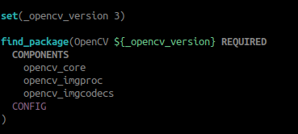
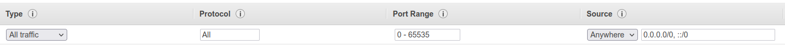
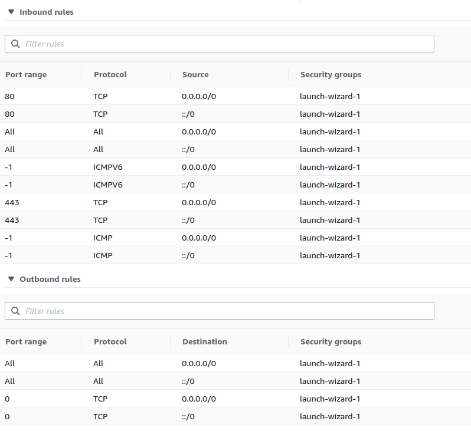

# COVINS -- A Framework for Collaborative Visual-Inertial SLAM and Multi-Agent 3D Mapping

**Version 1.0**

COVINS is an accurate, scalable, and versatile visual-inertial collaborative SLAM system, that enables a group of agents to simultaneously co-localize and jointly map an environment.

COVINS provides a server back-end for collaborative SLAM, running on a local machine or a remote cloud instance, generating collaborative estimates from map data contributed by different agents running Visual-Inertial Odomety (VIO) and sharing their map with the back-end. COVINS also provides a generic communication module to interface the keyframe-based VIO of your choice. Here, we provide an example of COVINS interfaced with the VIO front-end of [ORB-SLAM3](https://github.com/UZ-SLAMLab/ORB_SLAM3). We provide guidance and examples how to run COVINS on the [EuRoC dataset](https://projects.asl.ethz.ch/datasets/doku.php?id=kmavvisualinertialdatasets), as well as information beyond basic deployment, for example how the COVINS back-end can be deployed on a remote cloud computing instance.

## Index
1. [Related Publications](#related_publications)
2. [License](#license)
3. [Basic Setup](#setup)
    * [Environment Setup](#setup_env)
    * [COVINS Installation](#setup_covins)
    * [Installing ROS Support for the ORB-SLAM3 Front-End](#setup_ros)
4. [Running COVINS](#running)
    * [Running the COVINS Server Back-End](#run_be)
    * [Running the ORB-SLAM3 Front-End](#run_fe)
    * [Visualization](#run_viz)
    * [User Interaction](#run_intercation)
    * [Parameters](#run_params)
    * [Output Files](#run_out)
    * [Running COVINS with ROS](#run_ros)
5. [Docker Implementation](#docker)
6. [Extended Functionalities](#extended)
    * [Deployment of the COVINS Back-End in an AWS Cloud Instance](#ext_aws)
    * [Interfacing a Custom VIO System with COVINS](#ext_comm)
    * [Map Re-Use Onboard the Agent](#ext_reuse)
7. [Limitations and Known Issues](#issues)

<a name="related_publications"></a>
## 1 Related Publications

[***COVINS***] Patrik Schmuck, Thomas Ziegler, Marco Karrer, Jonathan Perraudin and Margarita Chli. **COVINS: Visual-Inertial SLAM for Centralized Collaboration**. *IEEE International Symposium on Mixed and Augmented Reality (ISMAR)*, 2021. **[PDF](https://www.research-collection.ethz.ch/handle/20.500.11850/507909)**

[*Redundancy Detection*] Patrik Schmuck and Margarita Chli. **On the Redundancy Detection in Keyframe-based SLAM**. *IEEE International Conference on 3D Vision (3DV)*, 2019. **[PDF](https://www.research-collection.ethz.ch/bitstream/handle/20.500.11850/380451/2019_redundancy_detection.pdf?sequence=1&isAllowed=y)**.

[*System Architecture*] Patrik Schmuck and Margarita Chli. **CCM‐SLAM: Robust and Efficient Centralized Collaborative Monocular Simultaneous Localization and Mapping for Robotic Teams**. *Journal of Field Robotics (JFR)*, 2019. **[PDF](https://www.research-collection.ethz.ch/handle/20.500.11850/313259)**

[*Collaborative VI-SLAM*] Patrik Schmuck, Marco Karrer and Margarita Chli. **CVI-SLAM - Collaborative Visual-Inertial SLAM**. *IEEE Robotics and Automation Letters (RA-L)*, 2018. **[PDF](https://www.research-collection.ethz.ch/bitstream/handle/20.500.11850/294281/2018_IROS_Karrer.pdf?sequence=7&isAllowed=y)**


#### Video:
<a href="https://www.youtube.com/embed/FxJTY5x1fGE" target="_blank"></a>

<a name="license"></a>
## 2 License

COVINS is released under a [GPLv3 license](https://github.com/VIS4ROB-lab/covins/blob/master/.aux/licencse_gpl.txt). For a list of code/library dependencies (and associated licenses), please see [thirdparty_code.md](https://github.com/VIS4ROB-lab/covins/blob/master/.aux/thirdparty_code.md).


For license-related questions, please contact the authors:
collaborative (dot) slam (at) gmail (dot) com.

If you use COVINS in an academic work, please cite:

	@article{schmuck2021covins,
	  title={COVINS: Visual-Inertial SLAM for Centralized Collaboration},
	  author={Schmuck, Patrik and Ziegler, Thomas and Karrer, Marco and Perraudin, Jonathan and Chli, Margarita},
	  journal={arXiv preprint arXiv:2108.05756},
	  year={2021}
	}

<a name="setup"></a>
## 3 Basic Setup
This section explains how you can build the COVINS server back-end, as well as the provided version of the ORB-SLAM3 front-end able to communicate with the back-end. COVINS was developed under Ubuntu *18.04*, and we provide installation instructions for *18.04* as well as *20.04*. Note that we also provide a [Docker implementation](#docker) for simplified deployment of COVINS.

**Note**: Please pay attention to the ```CMAKE_BUILD_TYPE```. Particularly, building parts of the code with ```march=native``` can cause problems on some machines.

<a name="setup_env"></a>
### Environment Setup

#### Dependencies

* ```sudo apt-get update```
* Install dependencies: ```sudo apt-get install libpthread-stubs0-dev build-essential cmake git doxygen libsuitesparse-dev libyaml-cpp-dev libvtk6-dev python3-wstool libomp-dev libglew-dev```
* _catkin_tools_ (from the [catkin_tools manual](https://catkin-tools.readthedocs.io/en/latest/installing.html))
    * ```sudo sh -c 'echo "deb http://packages.ros.org/ros/ubuntu `lsb_release -sc` main" > /etc/apt/sources.list.d/ros-latest.list'```
    * ```wget http://packages.ros.org/ros.key -O - | sudo apt-key add -```
    * ```sudo apt-get update```
    * ```sudo apt-get install python3-catkin-tools```
* _ROS_
    * [Melodic](https://wiki.ros.org/melodic/Installation/Ubuntu) (Ubuntu 18)
    * [Noetic](https://wiki.ros.org/noetic/Installation/Ubuntu) (Ubuntu 20)

#### Set up your workspace

This will create a workspace for COVINS as ```~/ws/covins_ws```. All further commands will use this  path structure - if you decide to change the workspace path, you will need to adjust the commands accordingly.

* ```cd ~```
* ```mkdir -p ws/covins_ws/src```
* ```cd ~/ws/covins_ws```
* ```catkin init```
* ROS Setup
    * **U18/Melodic**: ```catkin config --extend /opt/ros/melodic/```
    * **U20/Noetic**: ```catkin config --extend /opt/ros/noetic/```
* ```catkin config --merge-devel```
* ```catkin config --cmake-args -DCMAKE_BUILD_TYPE=RelWithDebInfo```

<a name="setup_covins"></a>
### COVINS Installation

We provide a script (```covins/install_file.sh```) that will perform a full installation of COVINS, including back-end, front-end, and third-party packages, if the environment is set up correctly. **If the installation fails, we strongly recommend executing the steps in the build script manually one by one**. The script might not perform a correct installation under certain circumstances if executed multiple times.

**Note**: If you are installing COVINS in a **Virtual Machine** (VM) or a computer with fewer resources, make sure to allocate enough memory and/or swap to ensure a successful installation. We have successfully tested the COVINS installation with a VM with 16 GB RAM and 10 GB swap. An instruction to change the swap size can be found [here](https://ploi.io/documentation/server/change-swap-size-in-ubuntu).

* ```cd ~/ws/covins_ws/src```
* ```git clone https://github.com/VIS4ROB-lab/covins.git```
* ```cd ~/ws/covins_ws```
* ```chmod +x src/covins/install_file.sh```
* ```./src/covins/install_file.sh 8```
    * The argument ```8``` is optional, and specifies the number of jobs the build process should use. 

Generally, when the build process of COVINS or ORB-SLAM3 fails, make sure you have correctly sourced the workspace, and that the libraries in the third-party folders, such as ```DBoW2``` and ```g2o``` are built correctly.

A remark on ```fix_eigen_deps.sh```: compiling code with dependencies against multiple ```Eigen``` versions is usually fatal and must be avoided. Therefore, we specify and download the ```Eigen``` version explicitly through the ```eigen_catkin``` package, and make sure all ```Eigen```  dependencies point to this package.

<a name="setup_ros"></a>
### Installing ROS Support for the ORB-SLAM3 Front-End

If you want to use `rosbag` files to pass sensor data to COVINS, you need to explicitly build the ORB-SLAM3 front-end with ROS support.

* Install _vision_opencv_:
    * ```cd ~/ws/covins_ws/src```
    * Clone: ```git clone https://github.com/ros-perception/vision_opencv.git```
    * **Check out the correct branch**
        * ```cd vision_opencv/```
        * *U18/Melodic*: ```git checkout melodic```
        * *U20/Noetic*: ```git checkout noetic```
    * Open ```~/ws/covins_ws/src/vision_opencv/cv_bridge/CMakeLists.txt```
        * Add the ```opencv3_catkin``` dependency: change the line ```find_package(catkin REQUIRED COMPONENTS rosconsole sensor_msgs)``` to ```find_package(catkin REQUIRED COMPONENTS rosconsole sensor_msgs opencv3_catkin)```
        * If you are running **Ubuntu 20** (or generally have OpenCV 4 installed): remove the lines that search for an OpenCV 4 version in the ```CMakeLists.txt```. It should look like this:
        
    * ```source ~/ws/covins_ws/devel/setup.bash```
    * ```catkin build cv_bridge```
    * [Optional] Check correct linkage:
        * ```cd ~/ws/covins_ws/devel/lib```
        * ```ldd libcv_bridge.so | grep opencv_core```
        * This should only list ```libopencv_core.so.3.4``` as a dependency
* ```catkin build ORB_SLAM3```
* [Optional] Check correct linkage:
    * ```cd ~/ws/covins_ws/src/covins/orb_slam3/Examples/ROS/ORB_SLAM3```
        * ```ldd Mono_Inertial | grep opencv_core```
        * This should mention ```libopencv_core.so.3.4``` as the only ```libopencv_core``` dependency

<a name="running"></a>
## 4 Running COVINS

This section explains how to run COVINS on the [EuRoC dataset](https://projects.asl.ethz.ch/datasets/doku.php?id=kmavvisualinertialdatasets). If you want to use a different dataset, please do not forget to use a correct parameter file instead of ```covins/orb_slam3/Examples/Monocular-Inertial/EuRoC.yaml```.

**Note**: We strongly recommend running every agent and the server back-end in a separate terminal each.

#### Setting up the environment

* In ```~/ws/covins_ws/src/covins/covins_comm/config/config_comm.yaml```: adjust the value of ```sys.server_ip``` to the IP of the machine where the COVINS back-end is running.
* In *every* of the provided scripts to run the ORB-SLAM3 front-end (e.g., ```euroc_examples_mh1.sh```, in ```orb_slam3/covins_examples/```), adjust ```pathDatasetEuroc``` to the path where the dataset has been uncompressed. The default expected path is ```<pathDatasetEuroc>/MH_01_easy/mav0/...``` (for ```euroc_examples_mh1.sh```, in this case).
* In ```~/ws/covins_ws/src/covins/covins_backend/config/config_backend.yaml```: adjust the path of ```sys.map_path0``` to the directory where you would like to load maps from.

<a name="run_be"></a>
### Running the COVINS Server Back-End

* Source your workspace: ```source ~/ws/covins_ws/devel/setup.bash```
* In a terminal, start a roscore: ```roscore```
* In a new terminal, start the COVINS backend by executing ```rosrun covins_backend covins_backend_node```

<a name="run_fe"></a>
### Running the ORB-SLAM3 Front-End

Example scripts are provided in ```orb_slam3/covins_examples/```. Don't forget to correctly set the dataset path in every script you want to use (see above: *Setting up the environment*). You can also check the original [ORB-SLAM3 Repo](https://github.com/UZ-SLAMLab/ORB_SLAM3) for help on how to use the ORB-SLAM3 front-end.

* Download the [EuRoC dataset](https://projects.asl.ethz.ch/datasets/doku.php?id=kmavvisualinertialdatasets) (ASL dataset format)
* Open a a new terminal.
* Source your workspace: ```source ~/ws/covins_ws/devel/setup.bash```
* ```cd``` to the folder with the example scripts:```cd ~/ws/covins_ws/src/covins/orb_slam3/covins_examples/```
* Execute one of the example scripts provided in the ```orb_slam3/covins_examples/``` folder, such as ```euroc_examples_mh123_vigba```
    * **Note**: The example scripts **must be executed from inside the ```covins_examples``` folder**
    * ```euroc_examples_mhX.sh``` runs the front-end with a single sequence from EuRoC MH1-5.
    * ```euroc_examples_mh123_vigba.sh``` runs a 3-agent collaborative SLAM session (sequential) followed by Bundle Adjustment.
    * ```euroc_examples_mh12345_vigba.sh``` runs a 5-agent collaborative SLAM session (sequential) followed by Bundle Adjustment.
    * Multiple front-ends can run in parallel. The front-ends can run on the same machine, or on different machines connected through a wireless network. However, when running multiple front-ends on the same machine, note that the performance of COVINS might degrade if the computational resources are overloaded by running too many agents simultaneously. We recommend running every front-end instance in a separate terminal.
    * Common error sources:
        * If the front-end is stuck after showing ```Loading images for sequence 0...LOADED!```, most likely your dataset path is wrong.
        * If the front-end is stuck after showing ```--> Connect to server
``` or shows an error message ```Could no establish connection - exit```, the server is not reachable - the IP might be incorrect, you might have forgotten to start the server, or there is a problem with your network (try pinging the server IP)

COVINS does not support resetting the map onboard the agent. Since map resets are more frequent at the beginning of a session or dataset, for example due to faulty initialization, in the current implementation, the COVINS communication module is set up such that it only starts sending data if a pre-specified number of keyframes was already created by the front-end. This number is specified by ```comm.start_sending_after_kf``` in ```covins/covins_comm/config/config_comm.yaml```, and is currently set to 50. Also check [Limitations](#issues) for more details.

<a name="run_viz"></a>
### Visualization

COVINS provides a config file for visualization with RVIZ (```covins.rviz``` in ```covins_backend/config/```)

* In a new terminal: run ```tf.launch``` in ```covins_backend/launch/``` to set up the coordinate frames for visualization: ```roslaunch ~/ws/covins_ws/src/covins/covins_backend/launch/tf.launch```
* In a new terminal: launch RVIZ: ```rviz -d ~/ws/covins_ws/src/covins/covins_backend/config/covins.rviz```
    * Covisibility edges between keyframes from different agents are shown in red, while edges between keyframes from the same agent are colored gray (those are not shown by default, but can be activated by setting ```vis.covgraph_shared_edges_only``` to ```0``` in ```config_backend.yaml```).
    * In case keyframes are visualized, removed keyframes are displayed in red (keyframes are not shown by default, but can be activated in RVIZ).
    * The section _VISUALIZATION_ in ```config_backend.yaml``` provides several options to modify the visualization.


**NOTE**: When running multiple agents in parallel, and the maps are not merged yet, the visualization in RVIZ might toggle between the visualization of both trajectories.

<a name="run_intercation"></a>
### User Interaction

COVINS provides several options to interact with the map held by the back-end. This is implemented through ROS services.

* Make sure your workspace is sourced: ```source ~/ws/covins_ws/devel/setup.bash```
* **Map save:** ```rosservice call /covins_savemap <AGENT_ID>``` - this saves the map associated to the agent specified by ```AGENT_ID```.
    * The map will be saved to the folder ```..../covins_backend/output/map_data```. Make sure the folder is empty, before you save a map (COVINS performs a brief check - if a folder named ```keyframes/``` or ```mappoints/``` exists in the target directory, it will show an error and abort the map save process. Any other files or folders will not result in an error though).
* **Map load:** ```rosservice call /covins_loadmap 0``` - loads a map stored on disk, from the folder specified by ```sys.map_path0``` in ```config_backend.yaml```.
    * Note: map load needs to be performed **before** registering any agent.
    * ```0``` specifies the operation mode of the load functionality. ```0``` means "standard" map loading, while ```1``` and ```2``` will perform place recognition (```1```) and place recognition and PGO (```2```). Note that both modes with place recognition are experimental, only "standard" map load is tested and supported for the open-source version of COVINS.
* **Bundle Adjustment:** ```rosservice call /covins_gba <AGENT_ID> <MODE>
``` - Performs visual-inertial bundle adjustemt on the map associated to the agent specified by ```AGENT_ID```. Modes: 0: BA *without* outlier rejection, 1: BA *with* outlier rejection.
* **Map Compression / Redundancy Removal:** ```rosservice call /covins_prunemap <AGENT_ID> <MAX_KFs>``` - performs redundancy detection and removal on the map associated to the agent specified by ```AGENT_ID```.
    * ```MAX_KFs``` specifies the target number of keyframes held by the compressed map. If ```MAX_KFs=0```, the threshold value for measuring redundancy specified by the parameter ```kf_culling_th_red``` in ```config_backend.yaml``` will be used.
    * All experiments with COVINS were performed specifying the target keyframe count. Therefore, we recommend resorting to this functionality.
    * The parameter ```kf_culling_max_time_dist``` in ```config_backend.yaml``` specifies a maximum time delta permitted between two consecutive keyframes, in order to ensure limit the error of IMU integration. If no keyframe can removed without violating this constraint, map compression will stop, even if the target number of keyframes is not reached.
* Note: After a map merge of the maps associated to Agent 0 and Agent 1, the merged map is associated to both agents, i.e. ```rosservice call /covins_savemap 0``` and ```rosservice call /covins_savemap 1``` will save the same (shared) map.

<a name="run_params"></a>
### Parameters

COVINS provides two parameter files to adjust the behavior of the system and algorithms.

* ```../covins_comm/config/config_comm.yaml``` contains all parameters related to communication and the agent front-end.
* ```../covins_backend/config/config_backend.yaml``` contains all parameters related to the server back-end.

The user should not be required to change any parameters to run COVINS, except paths and the server IP, as explained in this manual.

<a name="run_out"></a>
### Output Files

* COVINS automatically saves the trajectory estimate of each agent to a file in ```covins_backend/output```. The file ```KF_<AGENT_ID>.csv``` stores the poses associated to the agent specified by ```AGENT_ID```. Each row represents a single pose.
* COVINS can save the trajectory in 2 formats: *EuRoC format* and *TUM format*. Which one is used can be controlled via the parameter ```trajectory_format``` in ```config_backend.yaml```. 
    * **TUM format** (default): ```timestamp[s] t_x t_y t_z q_x q_y q_z q_w```
    * **EuRoC format**: ```timestamp[ns], t_x, t_y, t_z, q_w, q_x, q_y, q_z, vel_x, vel_y, vel_z, bias_gyro_x, bias_gyro_y, bias_gyro_z, bias_acc_x, bias_acc_y, bias_acc_z```
    * Each output file contains a suffix indicating the format: ```_ftum``` or  ```_feuroc```
* Trajectories in *TUM format* can be directly evaluated using the [evo evaluation tool](https://github.com/MichaelGrupp/evo).
    * Run the evaluation e.g. as ```evo_ape euroc KF_0_ftum.csv gt_data.csv -vas``` to perform a Sim(3) alignment reporting trajectory RMSE and scale error.
    * The ground truth data for the individual EuRoC sequences can be found in ```<sequence>/mav0/state_groundtruth_estimate0/data.csv```
    * To evaluate a multi-agents estimate, the individual trajectory files must be combined, e.g. with ```cat KF_0_ftum.csv KF_1_ftum.csv KF_2_ftum.csv > mh123_est.csv```. Also, the individual ground truth information from the EuRoC sequences used to generate the estimate must be combined into a single file. We recommend doing this manually, since every file contains a header describing the data, which should not be copied multiple times.

<a name="run_ros"></a>
### Running COVINS with ROS

* Make sure your workspace is sourced: ```source ~/ws/covins_ws/devel/setup.bash```
* In ```~/ws/covins_ws/src/covins/orb_slam3/Examples/ROS/ORB_SLAM3/launch/launch_ros_euroc.launch```: adjust the paths for ```voc``` and ```cam```
* ```cd``` to ```orb_slam3/``` and run ```roslaunch ORB_SLAM3 launch_ros_euroc.launch```
* In a new terminal: run the rosbag file, e.g. ```rosbag play MH_01_easy.bag```
    * When using COVINS with ROS, we recommend skipping the initialization sequence performed at the beginning of each EuRoC MH trajectory. ORB-SLAM3 often performs a map reset after this sequence, which is not supported by COVINS and will therefore cause an error. For example, for MH1, this can be easily done by running ```rosbag play MH_01_easy.bag --start 45```. (Start at: MH01: 45s; MH02: 35s; MH03-05: 15s)

#### Running a second agent in parallel with ROS

When you want to run 2 (or more) agents in parallel, you need to adjust the launch files that you will be using in parallel to work in this setup. Particularly
* You need to **change the name of the ROS node**, since no 2 ROS nodes with the same name can exist simultaneously. 
* You need to **remap the input topics**, so that ROS nodes for different agents listen to different camera and IMU topics
* You need to **remap the topics of the bagfiles** for the individual agents, so that they 1) match the topics specified in the launch files and 2) the rosbag files played in parallel do not publish IMU and camera data under the same topic.

We provide an example for two agents. For the first agent, you can execute the launch file and play the bag file as described above. For the second agent, we provide ```launch_ros_euroc_second_agent.launch```.
* ```name``` is changed to ```ORB_SLAM3_monoi1```
* Expected input topics are changed to ```/cam0/image_raw1``` and ```/imu1```
* Run with ```roslaunch ORB_SLAM3 launch_ros_euroc_second_agent.launch``` 
* Play the bag file of your choice with remapped topics by appending ```/cam0/image_raw:=/cam0/image_raw1 /cam1/image_raw:=/cam1/image_raw1 /imu0:=/imu1```. For example, for ```MH_02_easy.bag```, you would run it with ```rosbag play MH_02_easy.bag --start 35 /cam0/image_raw:=/cam0/image_raw1 /cam1/image_raw:=/cam1/image_raw1 /imu0:=/imu1```

Note: if you **run multiple agents sequentially**, you only need to use ```launch_ros_euroc.launch```. After one agent has finished, just start it again using ```roslaunch ORB_SLAM3 launch_ros_euroc.launch``` and run your bagfile.

<a name="docker"></a>
## 5 Docker Implementation

We provide COVINS also as a Docker implementation. A guide how to install docker can be found [here](https://docs.docker.com/engine/install/). To avoid the need of `sudo` when running the commands below you can add your user to the `docker` group.

```sudo usermod -aG docker $USER``` (see https://docs.docker.com/engine/install/linux-postinstall/)

### Building the Docker Image

**NOTE:** The provided docker implementation will **not build** if you have previously built your cloned version of COVINS in a catkin workspace using the instructions provided above. If you want to use the docker implementation, please **perform the docker build with a freshly cloned version of COVINS**

Build the docker file using the Make file provided in the `docker` folder. Provide the number of jobs `make` and `catkin build` should use. This can take a while. If the build fails try again with a reduced number of jobs value.

* ```make build NR_JOBS=14```
    
### Running the Docker Image
The docker image can be used to run different parts of COVINS (e.g. server, ORB-SLAM3 front-end, ...).

#### ROSCORE
To start the roscore one can either use the host system ROS implementation (if ROS is installed). Otherwise, it can be started using the docker image.
* ```./run.sh -c```

#### COVINS Server Back-End
The convins server back-end needs a running roscore, how to start one see above. Furthermore, the server needs two configuration files, one for the communication server on one for the back-end. These two files need to be linked when running the docker image.
* ```./run.sh -s ../covins_comm/config/config_comm.yaml ../covins_backend/config/config_backend.yaml```

#### ORB-SLAM3 Front-End
The ORB-SLAM3 front-end client needs the communication server config file, the file which should be executed, and the path to the dataset. The dataset has to be given seperately since the file system of the docker container differs from the host system. Hence, the `pathDatasetEuroc` variable in the run script gets adapted automatically inside the docker container.
* ```./run.sh -o ../covins_comm/config/config_comm.yaml ../orb_slam3/covins_examples/euroc_examples_mh1 <dataset_path, e.g. /home/pschmuck/data/euroc>```

#### ORB-SLAM3 ROS Front-End
The ROS wrapper of the ORB-SLAM3 front-end can also be started in the docker container. It requires the server config file and the ROS launch file. A bag file can then for example be played on the host system.
* ```./run.sh -r ../covins_comm/config/config_comm.yaml ../orb_slam3/Examples/ROS/ORB_SLAM3/launch/launch_docker_ros_euroc.launch```

#### Terminal
A terminal within the docker image can also be opened. This can for example be used to send `rosservice` commands.
* ```./run.sh -t```

<a name="extended"></a>
## 6 Extended Functionalities

<a name="ext_aws"></a>
### Deployment of the COVINS Back-End in an AWS Cloud Instance

We have tested COVINS with remote cloud servers provides by [Amazons AWS](https://aws.amazon.com/). We recommend using [screen](https://linuxize.com/post/how-to-use-linux-screen/) to run COVINS remotely on a cloud instance, since this allows to return to previous sessions evens after disconnecting from the remote instance.
[Tutorial: Get started with Amazon EC2 Linux instances](https://docs.aws.amazon.com/AWSEC2/latest/UserGuide/EC2_GetStarted.html)

#### Cloud Setup

* Choose an AWS instance to launch (EC2 instance, Ubuntu 18 or 20 virtual machine, for example a ```c4.4xlarge``` with 30 GB storage is a good starting point)
* AWS virtual machines by default block most incoming and outgoing traffic, so you need to adjust the security groups. Don't forget to modify both inbound and outbound rules.
    * Some information on setting security groups can be found [here](https://aws.amazon.com/premiumsupport/knowledge-center/connect-http-https-ec2/).
    * As a straightforward solution, you can just allow **any** traffic: In *Step 6: Configure Security Group* of the AWS instance launch process, add a rule as follows (note that this leaves your remote server also unprotected against unauthorized access):

<!--
    * The following rules will allow **any** traffic (note that this leaves your remote server also unprotected against unauthorized access):

-->
* Launch your instance and install COVINS
* On your local machine (or any other machine where you would like to run the front-end), set ```sys.server_ip``` in ```config_comm.yaml``` to the **public** IPv4 address of your instance
    * Try to ping the IP from your local machine. If this does not work, the security groups are definitely not set up correctly and the back-end on the remote instance will not be reachable.
* Start the covins back-end on the remote instance as usual using ```rosrun covins_backend covins_backend_node```
* Start the front-end on your local machine as usual using one of the provided example files.
* The front-end should be able to connect to the cloud server, and you should see the server displaying messages that data is arriving there.

#### Visualization

We will use [screen](https://linuxize.com/post/how-to-use-linux-screen/) to run COVINS remotely on a cloud server

* On the **remote server** (connect via ssh - your AWS instance will give instructions how to do this)
    * ```screen -S covins```
    * ```roscore```
    * New window: ```Ctrl+a```, then ```c```
    * ```export ROS_IP=public_IP_of_!SERVER!```
    * ```cd ~/ws/covins_ws/```
    * ```source devel/setup.bash```
    * ```roslaunch src/covins/covins_backend/launch/tf.launch```
    * New window: ```Ctrl+a```, then ```c```
    * ```export ROS_IP=public_IP_of_!SERVER!```
    * ```cd ~/ws/covins_ws/```
    * ```source devel/setup.bash```
    * Run the back-end using ```rosrun covins_backend covins_backend_node```
* In a shell on your **local machine**
    * ```export ROS_IP=IP_of_your_!LOCAL!_machine```
    * ```export ROS_MASTER_URI=http://IP_of_the_!SERVER!:11311```
    * Launch RVIZ: ```rviz -d ~/ws/covins_ws/src/covins/covins_backend/config/covins.rviz``` (you need to have ```covins.rviz```  locally.
* Now you should be able to remotely visualize the RVIZ topics published from the COVINS backend running on the cloud server.

<a name="ext_comm"></a>
### Interfacing a Custom VIO System with COVINS

COVINS exports a generic communication interface, that can be integrated into custom keyframe-based VIO systems in order to share map data with the server back-end and generate a collaborative estimate. The code for the communication interface is located in the ```covins_comm``` folder, which builds a library with the same name that facilitates communication between the VIO system onboard the agent and the COVINS server back-end.

For straightforward understanding which steps need to be taken to interface a VIO front-end with COVINS, we have defined the preprocessor macro ```COVINS_MOD``` in ```covins/covins_comm/include/covins/covins_base/typedefs_base.hpp```. **This macro indicates all modifications made to the original ORB-SLAM3 code in order to set up the communication with the server back-end.**

In a nutshell, the communication interface provides a base communicator class, which is intended to be used to create a derived communicator class tailored to the VIO system. The communicator module runs in a separate thread, taking care of setting up a connection to the server, and exchanging map data. For the derived class, the user only needs to define a function that can be used to pass data to the communicator module and fill the provided data containers, and the ```Run()``` function that is continuously executed by the thread allocated to the communicator module. Furthermore, the communicator module uses the predefined message types ```MsgKeyframe``` and ```MsgLandmark``` for transmitting data to the server, therefore, the user needs to define functions that fill those messages from the custom data structures of the VIO system.

<a name="ext_reuse"></a>
### Map Re-Use Onboard the Agent

COVINS also provides the functionality to share data from the collaborative estimate on the server-side with the agents participating in the estimate. COVINS provides only the infrastructure to share this data, the method for map re-use needs to be implement by the user.

By default, COVINS is configured to not send any data back to the agent. By setting ```comm.data_to_client``` to ```1``` in ```config_comm.yaml```, this functionality can be activated. By default, the server then regularly sends information about one keyframe back to the agent. The agent will display a message that requests the user to define what to do with the received information.

* In the function ```CollectDataForAgent()``` in ```covins_backend/src/covins_backend/```, the data to send to the agent can be specified.
* In the function ```ProcessKeyframeMessages()``` in ```orb_slam3/src/```, the processing of the received keyframe can be specified.

<a name="issues"></a>
## 7 Limitations and Known Issues

* [**TOGGLING VISUALIZATION**] When running multiple agents in parallel, and the maps are not merged yet, the visualization in RVIZ might toggle between the visualization of both trajectories.
* [**MAP RESET**] ORB-SLAM3 has the functionality to **start a new map** when tracking is lost, in order to improve robustness. This functionality is **not supported** by COVINS. The COVINS server back-end assumes that keyframes arriving from a specific agent are shared in a continuous fashion and belong to the same map, and if the agent map is reset and a second keyframe with a previously used ID arrives again at the server side, the back-end will detect this inconsistency and throw an error. We have almost never experienced this behavior on the EuRoC sequences when using the ASL dataset format, and rarely when using rosbag files. 
    * Too little computational resources available to the front-end can be a reason for more frequent map resets.
    * Map resets are more frequent at the beginning of a dataset, and occur less when the VIO front-end is well initialized and already tracking the agent's pose over some time. Therefore, the communication module will only start sending data to the server once a pre-specified number of keyframes was created by the VIO front-end. This number is specified by ```comm.start_sending_after_kf``` in ```covins/covins_comm/config/config_comm.yaml```, and is currently set to 50.
    * Particularly when running with rosbag files, setting the parameter  ```orb.imu_stamp_max_diff: 2.0``` in ```covins/covins_comm/config/config_comm.yaml```, instead of the default (```1.0```), helped to significantly reduce map resets. We did not see any negative impact on the accuracy of the COVINS collaborative estimate from this change.
* [**Duplicate Files**] The repository contains 2 copies of the ORB vocabularies, as well as 2 versions of the DBoW library. We decided to use this structure in order to keep the code of COVINS and ORB-SLAM3 as much separated as possible.
* [**Mixed Notation**] COVINS mainly utilizes the *Google C++ Style Guide*. However, some modules re-use code of other open-source software using *Hungarian notation*, such as CCM-SLAM and ORB-SLAM2, and this code was not ported to the new notation convention yet (particularly, this applies to code parts related to the FeatureMatcher, KFDatabase, PlaceRecognition, Se3Solver).
